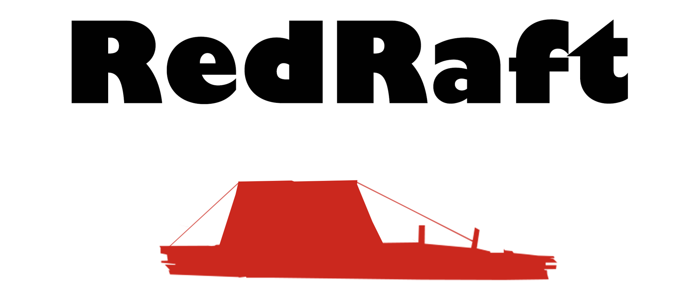

<p align="center">


</p>

RedRaft is an experimental project that allows for [Redis](http://redis.io) to run in a [Raft](https://raft.github.io/) environment. It uses [Finn](https://github.com/tidwall/finn) for the Raft implementation and Redis for the state-machine providing a fault-tolerant cluster. 

Getting Started
---------------

### Building

1. Install [Redis](http://redis.io/download).

2. Build RedRaft

```sh
$ git clone https://github.com/tidwall/redraft
$ cd redraft
$ make
```

Optionally you can download a prebuilt [zip](https://github.com/tidwall/redraft/releases/download/demo/redraft-demo-darwin-amd64.zip) for Mac OS which includes Redis and RedRaft.

### Running

First start a single-member cluster:
```
$ ./redraft
```

This will start the server listening on port 7481 for client and server-to-server communication.

Next, let's set a single key, and then retrieve it:

```
$ redis-cli -p 7481 SET mykey "my value"
OK
$ redis-cli -p 7481 GET mykey
"my value"
```

Adding members:
```
$ ./redraft -p 7482 -dir data2 -join 7481
$ ./redraft -p 7483 -dir data3 -join 7481
```

That's it. Now if node1 goes down, node2 and node3 will continue to operate.


Supported Commands
------------------
get, strlen, exists, getbit, getrange, substr, mget,
llen, lindex, lrange, sismember, scard, srandmember,
sinter, sunion, sdiff, smembers, sscan, zrange,
zrangebyscore, zrevrangebyscore, zrangebylex, zrevrangebylex,
zcount, zlexcount, zrevrange, zcard, zscore, zrank,
zrevrank, zscan, hget, hmget, hlen, hstrlen, hkeys,
hvals, hgetall, hexists, hscan, randomkey, keys, scan,
dbsize, echo, type, info, ttl, pttl, dump, object,
memory, time, bitpos, bitcount, geohash, geopos, geodist,
pfcount, set, setnx, setex, psetex, append, del, setbit,
bitfield, setrange, incr, decr, rpush, lpush, rpushx,
lpushx, linsert, rpop, lpop, brpop, brpoplpush, blpop,
lset, ltrim, lrem, rpoplpush, sadd, srem, smove, spop,
sinterstore, sunionstore, sdiffstore, zadd, zincrby, zrem,
zremrangebyscore, zremrangebyrank, zremrangebylex, zunionstore,
zinterstore, hset, hsetnx, hmset, hincrby, hincrbyfloat,
hdel, incrby, decrby, incrbyfloat, getset, mset, msetnx,
select, move, rename, renamenx, expire, expireat, pexpire,
pexpireat, auth, flushdb, flushall, sort, persist, config,
restore, migrate, bitop, geoadd, georadius,
georadiusbymember, pfadd, pfmerge:

Not Supported
-------------
Cluster, Replication, and PubSub commands.

Built-in Raft Commands
----------------------
Here are a few commands for monitoring and managing the cluster:

- **RAFTADDPEER addr**  
Adds a new member to the Raft cluster
- **RAFTREMOVEPEER addr**  
Removes an existing member
- **RAFTLEADER**  
Returns the Raft leader, if known
- **RAFTSNAPSHOT**  
Triggers a snapshot operation
- **RAFTSTATE**  
Returns the state of the node
- **RAFTSTATS**  
Returns information and statistics for the node and cluster

Read Consistency
----------------

The `--consistency` param has the following options:

- `low` - all nodes accept reads, small risk of [stale](http://stackoverflow.com/questions/1563319/what-is-stale-state) data
- `medium` - only the leader accepts reads, itty-bitty risk of stale data during a leadership change
- `high` - only the leader accepts reads, the raft log index is incremented to guaranteeing no stale data

For example, setting the following options:

```
$ ./redraft --consistency high
```

Provides the highest level of consistency.

Leadership Changes
------------------

In a Raft cluster only the leader can apply commands. If a command is attempted on a follower you will be presented with the response:

```
SET x y
-TRY 127.0.0.1:7481
```

This means you should try the same command at the specified address.

Contact
-------
Josh Baker [@tidwall](http://twitter.com/tidwall)

License
-------
RedRaft source code is available under the MIT [License](/LICENSE).
